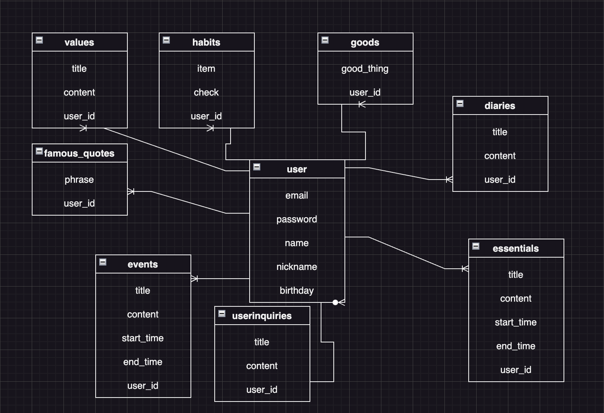
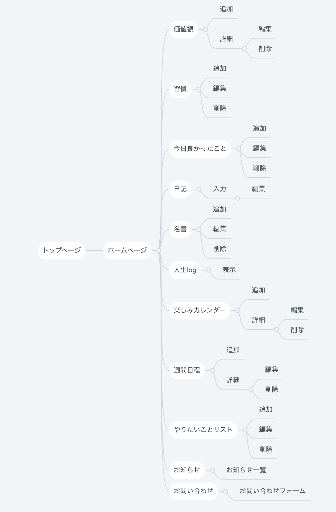

# README

# アプリケーション名
 Life Shift Story

# アプリケーション概要

人生をより良い物語へ変化させる

# URL 
http://35.79.167.80/

# テスト用アカウント

メールアドレス：uta@uta 
パスワード：uta111

# 利用方法
## 価値観
1. 「作成」ボタンから価値観の名前とその内容を入力し保存する
1. 振り返りボタンから毎日価値観にあった行動ができたか振り返る。

## 習慣
1. 「作成」ボタンから習慣にしたいことの名前とその内容を入力し保存する
1. その習慣を行ったらチェックボックスにチェックを入れる

## 今日の良かったこと
1. 「作成」ボタンから今日良かったことの内容を入力し保存する

## 日記
1. 入力フォームから日記のタイトルと内容を入力し保存する。画像も保存したければ保存する。

## 名言
1. 「作成」ボタンから名言のフレーズを入力し保存する。
1. 毎日ランダムに1つが選択され表示される。

## 人生log
1. 検索フォームにキーワードもしくは日付を入力
1. 入力したものが表示され過去を振り返る

## やりたいことリスト
1. 「作成」ボタンからやりたいことのタイトル、内容、いつまでに達成したいか、実現させるためのアクションプランを入力し保存する。
## お知らせ
1. タイトルをクリックすることでその内容が表示される。

## お問い合わせフォーム
1. フォームに入力して送信ボタンを押すことで運営にお問い合わせすることができる。

## 楽しみカレンダー
・その月の楽しみなことだけを書いていくカレンダー
1. 予定のタイトル、内容、開始時間、終了時間を入力して保存する
1. カレンダーから予定をクリックすることで詳細を確認できる。

## 週間日程
・緊急ではないけど重要なことを書いていく週間カレンダー
1. 予定のタイトル、内容、開始時間、終了時間を入力して保存する。
1. カレンダーから予定をクリックすることで詳細を確認できる。
1. 予定をクリックすることでその日のタイムラインを確認できる。

# アプリケーションを作成した背景 
「死」は人間誰も平等に与えられている。人が死ぬとき後悔することの中に「もっと自由に生きればよかった」や「友人ともっと連絡を取ればよかった」など、生き方や人間関係に後悔を抱く人が多い。また、人間が死ぬとき最後に残されるもの、それは「記憶」である。良くも悪くも色濃い思い出が残され、思い出こそが人生の軌跡となる。このアプリは私が考える人生において重要な3つの要素「生き方」「人間関係」「思い出」を人生で最大化することによって、人生に最高の納得をすることができる。人生に最高の納得を得られることこそが幸せであると考えている。

# 洗い出した要件
https://docs.google.com/spreadsheets/d/1xGFuGmDNxX_v1BetMuZjyj_VYqrYM9zSJpC1lYhnlVw/edit?usp=sharing

# 実装予定の機能

## チュートリアルの作成
・このアプリの使い方の一連の流れを説明する

## メールアドレス認証
・登録時、メールに登録完了のURLを送信する

## 人生logの改良
・価値観の変更など人生の変遷をより詳細に表示できるようにする。

## 人生のキャッチコピーの追加、編集、削除機能
・userの人生におけるキャッチコピーを追加、編集、削除できるようにする。

# データベース設計

# 画面遷移図

# 開発環境

HTML/CSS/JavaScript/Ruby/Ruby on Rails/MySQL/Github/AWS/Visual Studio Code

# ローカルでの動作方法
git clone https://github.com/yukun1120/Life_Shift_Story
cd Life_Shift_Story
bundle install
yarn install
rails db:create
rails db:migrate

# 工夫したポイント
・gem 'whenever'を使い24時に表示がリセットできるようにした。